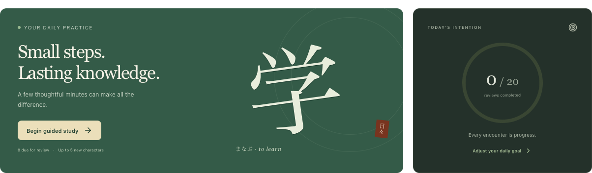
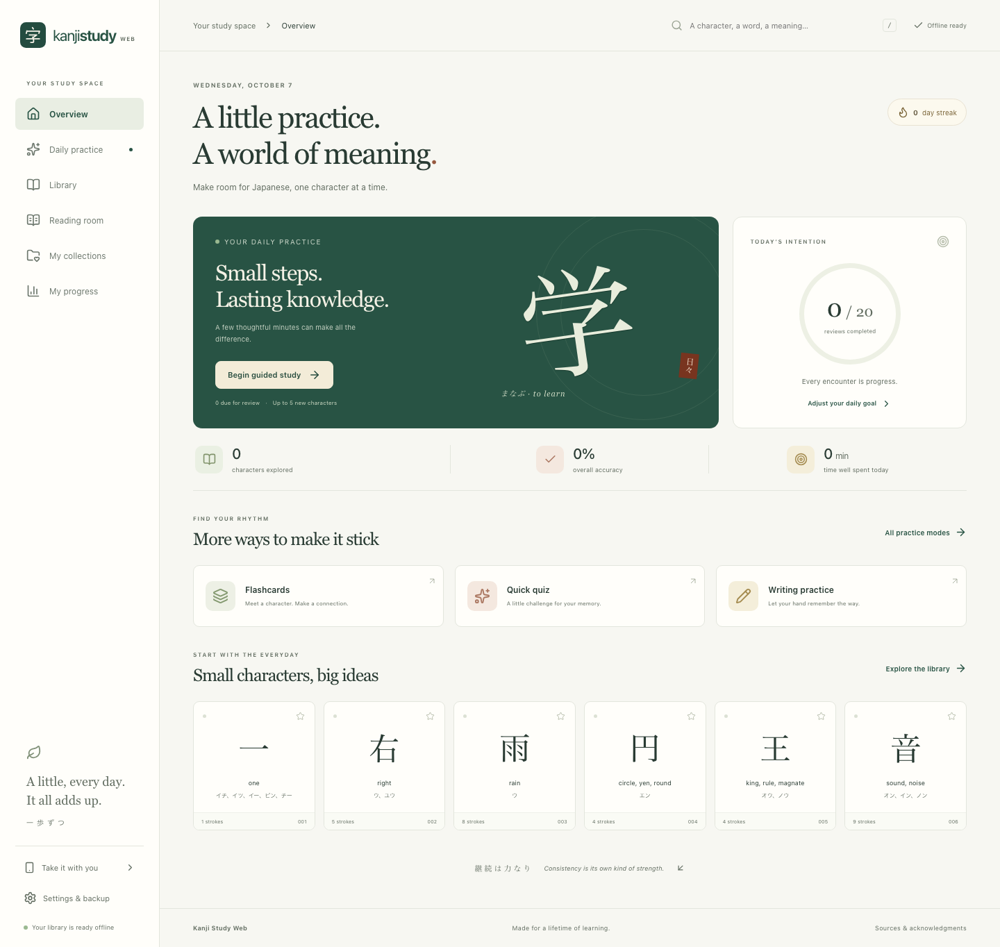
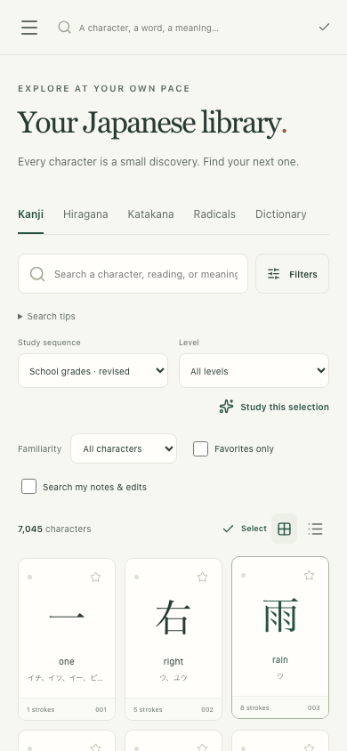
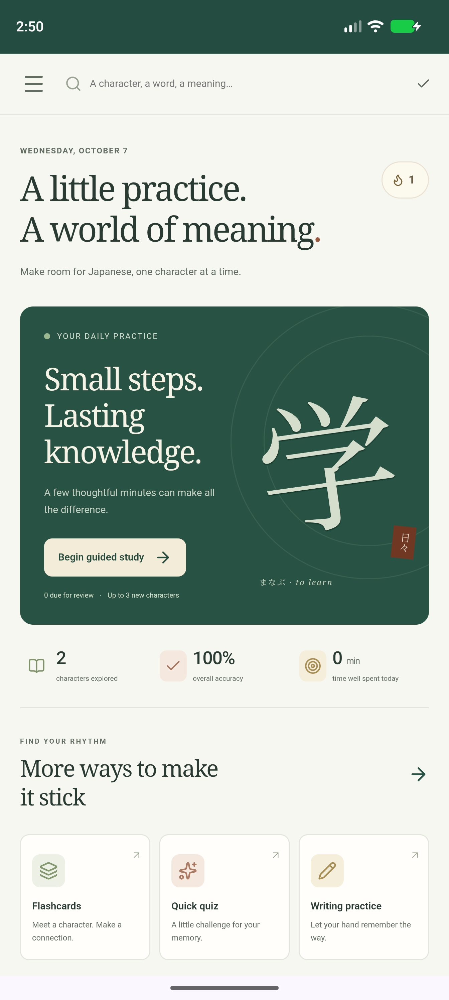

<p align="center">
  
</p>

<h1 align="center">Kanji Study Web</h1>

<p align="center">
  <strong>A little practice. A world of meaning.</strong><br />
  Your Japanese study space — offline, in your browser, at your own pace.
</p>

<p align="center">
  <a href="#install-and-go-offline"></a>
  <a href="docs/deployment.md"></a>
  <a href="#local-development"></a>
  <a href="LICENSE"></a>
</p>

<p align="center">
  
</p>

<p align="center">
  <a href="#features">Features</a> ·
  <a href="#screenshots">Screenshots</a> ·
  <a href="#quick-start">Quick start</a> ·
  <a href="#documentation">Documentation</a> ·
  <a href="#development">Development</a>
</p>

> [!NOTE]
> This is an **unofficial, AI-built** web implementation of the Android app [Japanese Kanji Study](https://play.google.com/store/apps/details?id=com.mindtwisted.kanjistudy). It is an independent project, unaffiliated with the original developer. **Android users are encouraged to install the original app for the best experience.**

Explore kanji, practice recall and handwriting, build personal collections, and keep a daily learning habit. Everything runs in your browser, with no account or application backend. Once the library is initialized, the app, dictionary, examples, and recorded audio work offline.

## Features

| Explore                                            | Learn                                                                    | Listen                                 |
| :------------------------------------------------- | :----------------------------------------------------------------------- | :------------------------------------- |
| **7,000+** kanji · **148** kana · **265** radicals | **200,000+** words · **80,000+** names · **10,000+** annotated sentences | **8,132** native vocabulary recordings |

All counts refer to the supplied catalog. See the [data audit](docs/research/data-audit.md) for coverage and provenance.

For words and sentences without recordings, optionally configure an **OpenAI-compatible AI speech API** in Settings using your own key. Choose **PCM** as the output format for Gemini TTS on OpenRouter; MP3 remains the default. Generated audio is reused offline from a cache limited to **10 clips and 50 MB**. Turn off **Enable AI speech** to use Japanese browser speech while retaining your configuration and cache; browser speech is also used without an API key. See [AI speech setup and behavior](docs/ai-speech.md).

Vocabulary search prioritizes exact matches and JLPT level, followed by available example counts and commonness. Word details include grouped definitions, separate part-of-speech labels, and mora pitch diagrams. Open any catalog example to explore its linked words and kanji, save notes, and mark it as read offline. See the [dictionary follow-up](docs/dictionary-parity.md) for reference comparisons and verification.

|                               | What you can do                                                                                                                                                                                  |
| :---------------------------- | :----------------------------------------------------------------------------------------------------------------------------------------------------------------------------------------------- |
| 🔎 **Explore the dictionary** | Search by text, reading, or romaji. Combine filters, inspect components and stroke counts, play stroke-order animations, and follow examples, related entries, and additional-language readings. |
| ✍️ **Practice four ways**     | Use flashcards, multiple-choice quizzes, handwriting with geometric feedback, and contextual reading. Self-assess, repeat mistakes, and resume saved sessions.                                   |
| 🌱 **Build a daily habit**    | Follow local spaced repetition with daily new-character limits, familiarity ratings, goals, streaks, activity, and character rankings.                                                           |
| 📚 **Make it yours**          | Save favorites and notes, customize meanings and readings, organize ordered sets, import text, and export CSV or Anki-compatible data.                                                           |
| 🔊 **Listen offline**         | Play every native vocabulary recording referenced by the supplied database. Optional device speech uses installed local Japanese voices.                                                         |
| 💾 **Keep your progress**     | Store your profile locally in IndexedDB, export full JSON backups, and restore through validated, transactional imports. New profiles start without the source user's learning history.          |
| 📱 **Study on any screen**    | Use desktop and mobile layouts, light/dark/device themes, keyboard navigation, touch writing, reduced-motion support, and home-screen installation.                                              |

<details>
<summary><strong>Study sequences and optional extensions</strong></summary>

Choose from **twelve supplied study sequences**, including Japanese school grades, JLPT, Remembering the Kanji, Kanji Kentei, Kanji Learner's Course, frequency, Hadamitzky, and Kanji in Context, with the supplied revisions.

Compatible, authorized extension content can be imported later. Locked original **KLC reading sets** and **Outlier explanations** are not bundled. See the [extension format and examples](docs/extensions.md).

</details>

## Screenshots

<p align="center">
  <a href="docs/screenshots/overview-desktop.png">
    
  </a>
  <br />
  <sub>Your daily study space: guided practice, progress, and a library to explore.</sub>
</p>

<table>
  <tr>
    <th width="50%">Browse on your phone</th>
    <th width="50%">Launch from your home screen</th>
  </tr>
  <tr>
    <td align="center" valign="top">
      <a href="docs/screenshots/library-mobile.png">
        
      </a>
    </td>
    <td align="center" valign="top">
      <a href="docs/screenshots/android-standalone.png">
        
      </a>
    </td>
  </tr>
  <tr>
    <td align="center">Search, filter, and choose what to study.</td>
    <td align="center">Installed PWA, captured in an Android emulator.</td>
  </tr>
</table>

## Quick start

Run commands from the repository root. The supplied database at `Resource/kanji.db` is required. The first data preparation downloads the pinned, licensed Kanji alive audio archive (about **124 MiB**).

### Docker

Use the prebuilt [Docker Hub image](https://hub.docker.com/r/cutano/kanji-study-web), available for **amd64 and arm64**:

```sh
docker run -d --name kanji-study-web --restart unless-stopped \
  -p 127.0.0.1:8080:8080 --read-only --tmpfs /tmp:rw,size=16m,mode=1777 \
  --cap-drop ALL --security-opt no-new-privileges:true \
  cutano/kanji-study-web:0.2.4
```

The image already contains the dictionary and audio. Docker automatically selects your host's architecture. See the [deployment guide](docs/deployment.md) for tags and updates.

Or build from source:

With Docker and Compose installed:

```sh
docker compose up --build -d
```

Open **[localhost:8080](http://localhost:8080)**. Docker serves static files only; no server-side profile or database service is needed.

For phone or remote access, configure **HTTPS** at your reverse proxy. Ordinary HTTP on a LAN address cannot install the service worker. See [deployment instructions](docs/deployment.md) for ports, headers, storage, updates, and container verification.

### Local development

Requires **Node.js 24 or newer**.

```sh
npm ci
npm run data:prepare
npm run dev
```

Open the local URL printed by Vite. To verify installation and offline behavior, use a production build:

```sh
npm run build
npm run preview
```

Open **[localhost:4173](http://localhost:4173)**, then initialize the library as described below.

## Install and go offline

1. **Open the app** on localhost, or an HTTPS origin when using another device.
2. **Install it** using your browser's **Install app** action on Android. On iPhone or iPad, use **Safari → Share → Add to Home Screen**.
3. **Launch the installed app**, then select **Download & start learning**. Keep it open until the required resources are verified and saved (about **142.4 MiB**, plus the app shell).
4. **Study offline.** Reopen the app without a connection to browse, practice, and listen.

> [!IMPORTANT]
> On iPhone and iPad, initialize the library **inside the installed app**; Safari and home-screen storage can be separate. Browser storage may be cleared by the device or user, so request persistent storage and keep exported backups.

## Documentation

| If you want to…                                 | Start here                                                                                                                                       |
| :---------------------------------------------- | :----------------------------------------------------------------------------------------------------------------------------------------------- |
| Host the app and manage updates                 | [Deployment guide](docs/deployment.md)                                                                                                           |
| Understand the supported workflows              | [Requirements](docs/requirements.md) · [Project plan](docs/project-plan.md)                                                                      |
| See how offline data and profiles work          | [Architecture](docs/architecture.md)                                                                                                             |
| Import compatible extension content             | [Extension format and examples](docs/extensions.md)                                                                                              |
| Check data sources, coverage, and licenses      | [Data audit](docs/research/data-audit.md)                                                                                                        |
| Review verification and remaining device checks | [Release report](docs/release-report.md) · [Android verification](docs/android-verification.md) · [Release checklist](docs/release-checklist.md) |

## Development

**React + strict TypeScript + Vite** power the UI. A dedicated Web Worker queries the immutable SQLite reference catalog through a typed repository; IndexedDB stores user progress, settings, and extensions separately. Production fonts, scripts, styles, dictionary data, and required media are hosted locally.

After completing the local setup:

```sh
npm run typecheck
npm test
npm run build
npx playwright install chromium webkit
npm run test:e2e
```

The initial [release verification](docs/release-report.md) reports **62 passing unit/integration tests** and **22 production browser cases**; the [dictionary follow-up](docs/dictionary-parity.md) records expanded coverage. Tests cover source-derived data, parsers, scheduling, persistence, backup/extension validation, installation integrity, and handwriting geometry. Browser acceptance uses the actual bundled data and production service worker, including fresh-page offline reloads.

[Android emulator verification](docs/android-verification.md) also covers installation, a cold process launch with the origin unreachable, all four study modes, native audio, and persistence after restart. See the [test strategy](docs/testing.md) for details.

<details>
<summary><strong>Repository map</strong></summary>

| Directory         | Responsibility                                                                    |
| :---------------- | :-------------------------------------------------------------------------------- |
| `src/data/`       | Read-only SQLite worker, typed queries, verified catalog installer, text decoding |
| `src/domain/`     | Domain types, review scheduling, event recording, statistics                      |
| `src/state/`      | User profile transactions, validation, reactive subscriptions                     |
| `src/features/`   | Library, details, collections, reading, progress, settings, study workflows       |
| `src/components/` | Shared accessible UI and stroke rendering/input                                   |
| `scripts/`        | Reproducible data, icon, attribution, and deployment tools                        |
| `tests/e2e/`      | Production Chromium and mobile WebKit acceptance tests                            |
| `Resource/`       | Immutable user-supplied database and its schema reference                         |
| `docs/`           | Requirements, research, architecture, testing, deployment, and release evidence   |

</details>

## Known boundaries

| Area                    | What to expect                                                                                                                                               |
| :---------------------- | :----------------------------------------------------------------------------------------------------------------------------------------------------------- |
| **Handwriting**         | The source has no stroke paths for 628 kanji. Their glyphs remain browsable and self-assessed writing is available; automatic stroke grading requires paths. |
| **Audio**               | Native recordings cover 8,132 words, not every word or sentence. Optional device speech depends on installed Japanese voices and browser support.            |
| **Reminders**           | Export a recurring calendar reminder from Settings. A static offline app cannot reliably schedule background notifications on every mobile OS.               |
| **iOS acceptance**      | Mobile WebKit automation has been verified. Physical iPhone/iPad installation, memory, and storage behavior still require actual-device acceptance.          |
| **Original-app parity** | This project implements the observed core workflows; it does not claim the original app's proprietary scoring or scheduling algorithms.                      |

## License and attribution

Original project code is **LGPL-3.0-or-later**. See [LICENSE](LICENSE) and [COPYING](COPYING).

Third-party datasets and media retain their own licenses. The supplied database is user-provided reference material and its snapshot lacks complete upstream release metadata. Observed original-app credits and independently verified media sources are recorded in the [data audit](docs/research/data-audit.md).

Offline license and attribution files are included under `public/licenses/` and accessible in **Settings**. This project is not affiliated with or endorsed by the original Kanji Study Android developer.

---

<p align="center">
  <sub>A little, every day. It all adds up.</sub><br />
  <a href="#kanji-study-web">Back to top ↑</a>
</p>
